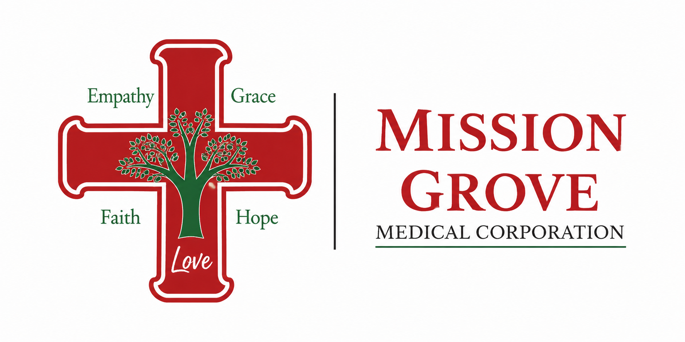

<!DOCTYPE ahtml>
<html lang="en">
<head>
    <meta charset="UTF-8">
    <meta name="viewport" content="width=device-width, initial-scale=1.0">
    <title>mgrovemed.com - Mission Grove Medical Corporation</title>
    
    
</head>
<body class="bg-gray-50">
    
    <!-- Navigation Bar -->
    <header class="shadow-lg sticky top-0 z-50 bg-white">
        

            

                <!-- Logo Section: Updated to match the provided 2.png logo -->
                

                    
                

                <!-- Navigation Links (Hidden on small, shown on medium+) -->
                <nav class="hidden md:flex space-x-10">
                    <a href="#home" class="text-base font-medium text-gray-500 hover:text-gray-900 transition duration-150">Home</a>
                    <a href="#services" class="text-base font-medium text-gray-500 hover:text-gray-900 transition duration-150">Services</a>
                    <a href="#location" class="text-base font-medium text-gray-500 hover:text-gray-900 transition duration-150">Location</a>
                </nav>

                <!-- CTA Button -->
                

                    <!-- Updated Primary CTA to Call -->
                    <a href="tel:9517803300" class="whitespace-nowrap inline-flex items-center justify-center px-4 py-2 border border-transparent rounded-lg shadow-sm text-base font-medium text-white bg-primary-red hover:bg-red-700 transition duration-300">
                        Call to Save a Spot
                    </a>
                    <!-- Disabled Online Booking CTA -->
                    
                        Online Booking Coming Soon
                    
                

            

        

    </header>

    <!-- Hero Section -->
    <section id="home" class="pt-16 pb-20 sm:pt-24 sm:pb-32 lg:pt-40 lg:pb-48 bg-gray-50">
        <!-- ... existing hero section code ... -->
        

            <h1 class="text-4xl sm:text-6xl lg:text-7xl font-extrabold tracking-tight text-gray-900">
                MGMC Urgent Care &
                <!-- Updated Line -->
                Wound Clinic
            </h1>
            

                Quality, compassionate medical care for your immediate needs and chronic wound healing, right here in Mission Grove.
            

            
            <!-- Rebranding Note -->
            

                

                    

                        **Formerly AFC Urgent Care- Riverside, now operating as Mission Grove Medical Urgent Care & Clinic!** We still offer the same high quality service that you know and trust!
                    

                

            

            

                <!-- Disabled Online Booking CTA -->
                
                    Online Booking Coming Soon
                
                <a href="#services" class="w-full sm:w-auto inline-flex items-center justify-center px-8 py-3 border border-gray-300 text-base font-medium rounded-lg shadow-lg text-gray-700 bg-white hover:bg-gray-100 transition duration-300 transform hover:scale-105">
                    See Our Services
                </a>
            

            
            <!-- Clarifying Note -->
            

                **Note:** Our online **save a spot** feature is currently unavailable. Please call us at (951) 780-3300 to **save a spot**.
            

        

    </section>

    <!-- Services Section -->
    <section id="services" class="py-16 sm:py-24 bg-white">
        

            

                <h2 class="text-base color-primary-red font-semibold tracking-wide uppercase">Our Specialties</h2>
                

                    Comprehensive Care When You Need It Most
                

            

            <!-- Specialty Grid: Now 3 columns on large screens -->
            

                
                <!-- Urgent Care Card -->
                

                    

                         <!-- Medical Icon -->
                         <svg class="w-6 h-6" fill="none" stroke="currentColor" viewBox="0 0 24 24" xmlns="http://www.w3.org/2000/svg"><path stroke-linecap="round" stroke-linejoin="round" stroke-width="2" d="M12 9v3m0 0v3m0-3h3m-3 0H9m12 0a9 9 0 11-18 0 9 9 0 0118 0z"></path></svg>
                    

                    <h3 class="mt-6 text-xl font-bold text-gray-900">Urgent Care & Walk-ins</h3>
                    

                        For non-life-threatening illnesses and injuries that need immediate attention. Skip the long waits of the ER for things like colds, flu, minor fractures, cuts, and infections.
                    

                    <ul class="mt-4 space-y-2 text-sm text-gray-600 list-disc list-inside">
                        <li>Acute illness visits</li>
                        <li>Minor injury care</li>
                        <li>Physical exams & Wellness checks</li>
                        <li>Work, school, and clearance forms</li>
                    </ul>
                

                <!-- Wound Care Card -->
                

                    

                         <!-- Wound Care Icon (Shield/Protection) -->
                         <svg class="w-6 h-6" fill="none" stroke="currentColor" viewBox="0 0 24 24" xmlns="http://www.w3.org/2000/svg"><path stroke-linecap="round" stroke-linejoin="round" stroke-width="2" d="M9 12l2 2 4-4m5.618-4.016A11.955 11.955 0 0112 2.944a11.955 11.955 0 01-8.618 3.04A12.001 12.001 0 002 15.46V18a2 2 0 002 2h16a2 2 0 002-2v-2.54a12.001 12.001 0 00-1.382-7.516z"></path></svg>
                    

                    <h3 class="mt-6 text-xl font-bold text-gray-900">Expert Wound Management</h3>
                    

                        Specialized care for chronic, non-healing wounds, post-surgical wounds, and diabetic ulcers. Our experts promote rapid and complete healing.
                    

                    <ul class="mt-4 space-y-2 text-sm text-gray-600 list-disc list-inside">
                        <li>Diabetic Foot Ulcer Treatment</li>
                        <li>Venous & Arterial Ulcer Treatment</li>
                        <li>Pressure Injury Management</li>
                        <li>Debridement Services & Infection Eval.</li>
                    </ul>
                

                <!-- NUYU Aesthetics Card (New Specialty) -->
                

                    

                         <!-- Aesthetics Icon (Leaf/Wellness) -->
                         <svg class="w-6 h-6" fill="none" stroke="currentColor" viewBox="0 0 24 24" xmlns="http://www.w3.org/2000/svg"><path stroke-linecap="round" stroke-linejoin="round" stroke-width="2" d="M5 3v4M3 5h4M6 17v4m-2-2h4m5-16l2.286 6.857L21 12l-5.714 2.143L13 21l-2.286-6.857L5 12l5.714-2.143L13 3z"></path></svg>
                    

                    <!-- Hyperlinked Title to nuyutoday.com -->
                    <h3 class="mt-6 text-xl font-bold text-gray-900">
                        <a href="https://nuyutoday.com" target="_blank" rel="noopener noreferrer" class="hover:text-secondary-green transition duration-150">
                            NUYU Graceful Wellness & Aesthetics
                        </a>
                    </h3>
                    

                        Achieve your beauty and wellness goals with specialized treatments including body contouring, IV therapy, and personalized weight loss programs.
                    

                    <ul class="mt-4 space-y-2 text-sm text-gray-600 list-disc list-inside">
                        <li>Neurotoxins, Fillers, & Facials</li>
                        <li>Microneedling & Aesthetics</li>
                        <li>Organic & GLP-1 Weight Loss Programs</li>
                        <li>Wellness: IV Vitamins & Hydration Therapy</li>
                    </ul>
                

            

        

    </section>

    <!-- Gemini AI Assistant Section (New Component) -->
    <section id="ai-assistant" class="py-16 sm:py-24 bg-gray-100 border-t border-gray-200">
        

            

                <h2 class="text-base color-primary-red font-semibold tracking-wide uppercase">AI Health Resource Generator ✨</h2>
                

                    Get Quick, Reliable Health Information
                

                

                    Use our AI tool (powered by Gemini, a Google AI) to get summaries on minor symptoms or basic wound care advice. **(Note: This tool is for informational purposes only and is NOT a substitute for professional medical advice.)**
                

            

            

                <input 
                    type="text" 
                    id="userQuery" 
                    placeholder="E.g., What should I put on a minor burn? or, What are the symptoms of a sinus infection?" 
                    class="w-full px-4 py-3 border border-gray-300 rounded-lg focus:ring-secondary-green focus:border-secondary-green mb-4 text-gray-700"
                >

                

                    <button 
                        onclick="generateHealthAdvice('symptoms')" 
                        id="symptomButton"
                        class="w-full sm:w-1/2 inline-flex items-center justify-center px-4 py-3 border border-transparent text-base font-medium rounded-lg shadow-sm text-white bg-primary-red hover:bg-red-700 transition duration-300 transform hover:scale-[1.01]"
                    >
                        Check Symptoms Summary ✨
                    </button>
                    <button 
                        onclick="generateHealthAdvice('wound')" 
                        id="woundButton"
                        class="w-full sm:w-1/2 inline-flex items-center justify-center px-4 py-3 border border-transparent text-base font-medium rounded-lg shadow-sm text-white bg-secondary-green hover:bg-green-800 transition duration-300 transform hover:scale-[1.01]"
                    >
                        Basic Wound Advice ✨
                    </button>
                

                
                <!-- Output Area -->
                

                    

                    
Generating advice, please wait...

                

                

                    Results will appear here. Remember to contact us or call 911 for emergencies.
                

            

        

    </section>

    <!-- Location and Contact Section -->
    <section id="location" class="py-16 sm:py-24 bg-gray-50">
        

            

                <!-- Contact Details -->
                

                    <h2 class="text-base color-primary-red font-semibold tracking-wide uppercase">Find Us</h2>
                    

                        Your Local Clinic in Mission Grove
                    

                    

                        MG Medical is dedicated to serving the Riverside community with convenient and high-quality medical services.
                    

                    

                        <!-- Address -->
                        

                            <svg class="flex-shrink-0 h-6 w-6 color-primary-red" fill="none" stroke="currentColor" viewBox="0 0 24 24" xmlns="http://www.w3.org/2000/svg"><path stroke-linecap="round" stroke-linejoin="round" stroke-width="2" d="M17.657 16.657L13.414 20.9a1.998 1.998 0 01-2.828 0l-4.243-4.243m10.121-6.121a5 5 0 11-7.07 0 5 5 0 017.07 0z"></path></svg>
                            

                                <h4 class="font-bold text-gray-900">Address</h4>
                                
191 Alessandro Blvd #9a, Riverside, CA 92508

                                <!-- UPDATED "Get Directions" Link -->
                                <a href="https://maps.app.goo.gl/kJ9iiFocYQL1pe7S9" target="_blank" rel="noopener noreferrer" class="text-sm font-medium text-blue-600 hover:text-blue-800 transition duration-150">(Get Directions)</a>
                            

                        

                        <!-- Phone & Fax -->
                        

                            <svg class="flex-shrink-0 h-6 w-6 color-primary-red" fill="none" stroke="currentColor" viewBox="0 0 24 24" xmlns="http://www.w3.org/2000/svg"><path stroke-linecap="round" stroke-linejoin="round" stroke-width="2" d="M3 5a2 2 0 012-2h3.28a1 1 0 01.948.684l1.498 4.493a1 1 0 01-.502 1.21l-2.257 1.128a11.033 11.033 0 007.584 7.584l1.128-2.257a1 1 0 011.21-.502l4.493 1.498a1 1 0 01.684.949V19a2 2 0 01-2 2h-1C9.716 21 3 14.284 3 6V5z"></path></svg>
                            

                                <h4 class="font-bold text-gray-900">Call / Fax</h4>
                                
(951) 780-3300 (Phone)

                                
(951) 780-3303 (Fax)

                            

                        

                        
                        <!-- Hours -->
                        

                            <svg class="flex-shrink-0 h-6 w-6 color-primary-red" fill="none" stroke="currentColor" viewBox="0 0 24 24" xmlns="http://www.w3.org/2000/svg"><path stroke-linecap="round" stroke-linejoin="round" stroke-width="2" d="M12 8v4l3 3m6-3a9 9 0 11-18 0 9 9 0 0118 0z"></path></svg>
                            

                                <h4 class="font-bold text-gray-900">Operating Hours</h4>
                                
Mon - Fri: 8:00 AM - 8:00 PM

                                
Sat - Sun: 8:00 AM - 6:00 PM

                                
Walk-ins are welcome everyday.

                            

                        

                    

                

                <!-- Google Maps Embed -->
                

                    <iframe
                        src="https://www.google.com/maps/embed?pb=!1m18!1m12!1m3!1d3311.458641113032!2d-117.3481068847889!3d33.9037469806461!2m3!1f0!2f0!0!3m2!1i1024!2i768!4f13.1!3m3!1m2!1s0x80dca6006121408b%3A0x6522c0c79316b8b8!2s191%20Alessandro%20Blvd%20%239a%2C%20Riverside%2C%20CA%2092508!5e0!3m2!1sen!2sus!4v1672956983577!5m2!1sen!2sus"
                        width="100%"
                        height="100%"
                        style="border:0;"
                        allowfullscreen=""
                        loading="lazy"
                        referrerpolicy="no-referrer-when-downgrade"
                        class="absolute top-0 left-0 w-full h-full"
                    ></iframe>
                

            

        

    </section>

    <!-- Footer -->
    <footer class="bg-gray-800 py-8">
        

            
&copy; 2025 mgrovemed.com. Mission Grove Medical Corporation. All rights reserved.

            
Address: 191 Alessandro Blvd #9a, Riverside, CA 92508 | Phone: (951) 780-3300 | Fax: (951) 780-3303

        

    </footer>

    
</body>
</html>
